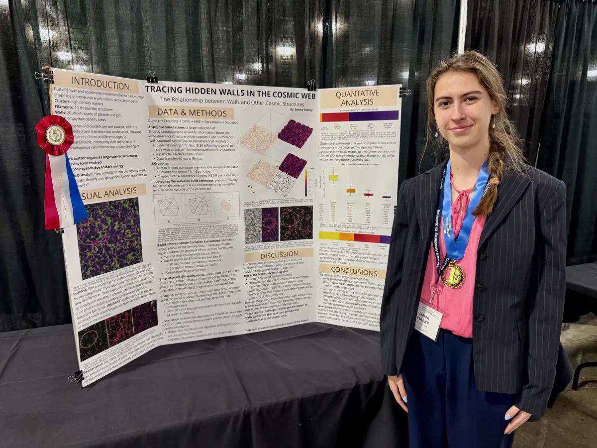
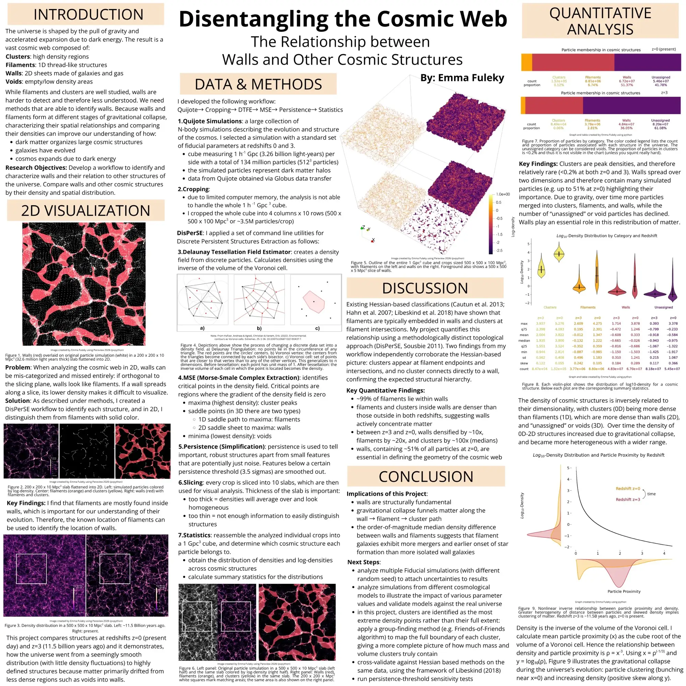
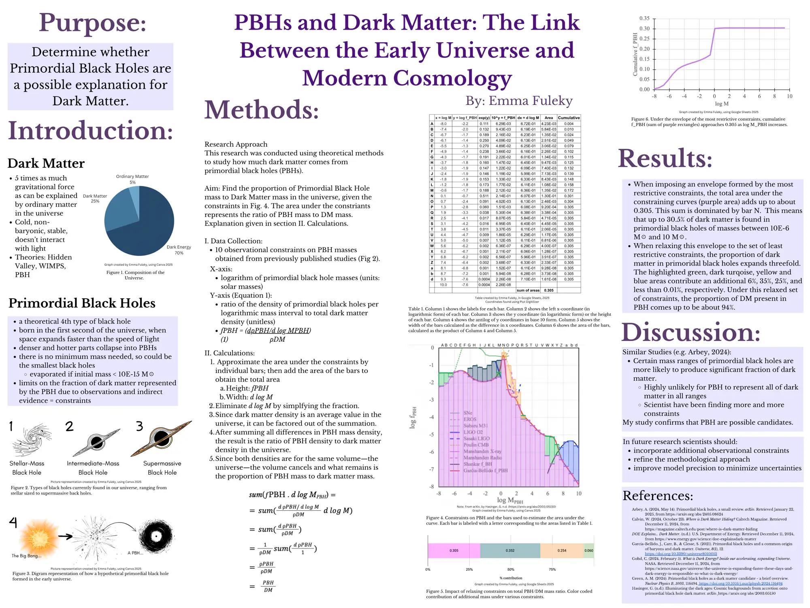

{.float-end .w-25 .ms-3 .mb-3}

I am interested in computational astrophysics and cosmology -- using large N-body
simulations, topological analysis, and scientific visualization to study how
matter is organized on the largest scales of the universe. My most recent project
builds an automated pipeline for extracting and quantifying the cosmic web. 

An admissions reader's implicit question about a project like this is how did a high school junior in Honolulu end up compiling DisPerSE from source, moving simulation data over Globus, and scripting ParaView? That path is genuinely unusual, and the answer is the most interesting thing about you. Right now the site documents the destination and hides the journey.

A short paragraph on the research page — how you found the problem, what made walls interesting rather than filaments, what you had to teach yourself, what broke — would do more for you than any additional technical detail. Numbers establish credibility; a specific origin story is what a reader remembers a week later.

The two projects below are a year apart. The first I did with ten published constraints and a spreadsheet; the second needed a topology library compiled from source, multi-gigabyte simulation snapshots moved over Globus, and a scripted visualization engine. Closing that gap was most of what I learned.

### Disentangling the Cosmic Web {#cosmic-web}

**The Relationship Between Walls and Other Cosmic Structures** [2026]{.cvdate}

- *Finalist, Regeneron International Science and Engineering Fair (ISEF), Phoenix, AZ*
- *1st Place, Physics and Astronomy, Hawaii State Science Fair* 
- [Project website and full documentation (including video with highlights and 3D visualization)](https://efuleky27.github.io/disperse/)
- [Project repo on GitHub](https://github.com/efuleky27/disperse)

#### The question

Gravity and the accelerating expansion driven by dark energy shape the universe
into a vast cosmic web of clusters, filaments, walls, and voids. Filaments and
clusters are well studied, but walls -- two-dimensional sheets of galaxies and
gas -- are diffuse, easily mistaken for filaments in two-dimensional slices, and
correspondingly less understood. Because walls and filaments form at different
stages of gravitational collapse, comparing their densities and spatial
relationships constrains how dark matter organizes large-scale structure and how
galaxies evolve within it.

**How do walls fit into the cosmic web, and how do their density and spatial
distribution compare to those of other structures?**

<!-- {width=65% fig-align="center"} -->

::: {.text-center}
{width=65% fig-alt="Components of the cosmic web"}
:::

#### The approach

I built an automated pipeline (Quijote -> cropping -> DTFE -> Morse–Smale
extraction -> persistence filtering -> statistics) that takes raw simulation
snapshots and returns quantified, visualized cosmic-web structure.

- **Data.** A Quijote N-body simulation with fiducial cosmological parameters at
  redshifts z = 0 and z = 3: a cube 1 h⁻¹ Gpc per side (≈1.5 Gpc, or about
  4.9 billion light-years) containing 134 million particles (512³), transferred
  via Globus.
  <!-- UNIT DISCREPANCY (flagged for Emma): the poster and the disperse homepage
       both gloss "1 h^-1 Gpc" as "3.26 billion light-years". 3.26 billion ly is
       the conversion for 1 Gpc *without* the h^-1. At the Quijote fiducial
       h = 0.6711, 1 h^-1 Gpc = 1000/0.6711 Mpc = 1.49 Gpc = ~4.9 billion ly.
       Either drop the h^-1 or fix the light-year figure -- and make the poster,
       the disperse homepage, and this page agree. -->
- **Cropping.** The full cube exceeds available memory, so I tiled it into
  4 × 10 crops of 500 × 500 × 100 Mpc³ (~3.5 million particles each) and rebased
  coordinates per crop for periodic tessellation, avoiding boundary artifacts.
- **Density field.** A Delaunay Tessellation Field Estimator converts discrete
  particles into a continuous density field, using the inverse Voronoi cell
  volume as the density at each point.
- **Topology.** Morse–Smale complex extraction (DisPerSE) locates critical
  points in the density field: maxima are clusters, 1D saddles trace filaments,
  2D saddles trace walls, and minima mark voids. Persistence filtering at a
  3.5σ threshold separates robust structures from noise.
- **Statistics.** Per-crop results are reassembled into the full simulation
  volume to determine which structure each particle belongs to, then aggregated
  into density distributions and summary statistics across all 40 crops.

<!-- {width=65% fig-align="center"} -->

::: {.text-center}
{width=65% fig-alt="Evolution of cosmic density"}
:::

#### What I found

- **~99% of filaments lie within walls.** Because filaments are far easier to
  detect, their known positions can be used to locate walls.
- **Walls contain ~51% of all particles today (redshift: z = 0)**, and 
  are therefore structurally fundamental to the geometry of the cosmic web, not 
  a marginal feature.
- **Density scales inversely with dimensionality:** clusters (0D) are denser
  than filaments (1D), which are denser than walls (2D), which are denser than
  voids (3D).
- **Filaments and clusters embedded in walls are denser than those outside
  them** at both redshifts, indicating that walls actively concentrate matter.
- **Between z = 3 and z = 0, median densities rose ~10× in walls, ~20× in
  filaments, and ~100× in clusters**, while the unassigned (void) population
  declined -- matter drains from voids into walls and is funneled along a
  wall -> filament -> cluster path.
- The order-of-magnitude median density gap between walls and filaments suggests
  that filament galaxies should show more mergers and an earlier onset of star
  formation than more isolated wall galaxies.

Two of my results reproduce what earlier studies found by a different
route: clusters appear at filament endpoints and intersections, and no cluster
connects directly to a wall. That earlier work uses Hessian-based classification,
which identifies structures from local curvature (Hahn et al. 2007; Cautun et
al. 2013; Libeskind et al. 2018); my pipeline is purely topological (DisPerSE;
Sousbie 2011). Because the two methods work so differently, their agreement
gives me real confidence in the pipeline. Full
[references](https://efuleky27.github.io/disperse/references.html) are on the
project site.

#### Tools

Python (NumPy, SciPy, h5py, Polars, Matplotlib) &middot; DisPerSE &middot; ParaView /
pvpython &middot; Globus &middot; Quarto &middot; Git/GitHub

#### Next steps

The pipeline is parameterized and reusable, which puts several extensions within
reach:

- **Attach uncertainties.** Re-run the analysis across multiple fiducial
  simulations with different random seeds, to put error bars on the density and
  membership statistics.
- **Vary the cosmology.** Apply the same pipeline to simulations built from
  different cosmological models, to find which parameters the wall statistics are
  sensitive to and how well each model matches the observed universe.
- **Measure whole clusters.** Add a Friends-of-Friends group finder so clusters
  are mapped as extended objects rather than single density peaks, giving a truer
  account of how much mass and volume they actually hold.
- **Cross-validate the method.** Run a Hessian-based classification on identical
  data, following the framework in Libeskind et al. (2018), to quantify where the
  two approaches agree and where they diverge.
- **Test robustness.** Sweep the persistence threshold to confirm the results are
  not an artifact of the 3.5σ cut.

::: {.text-center}
[{width=65% fig-alt="Science fair poster: Disentangling the Cosmic Web"}](https://efuleky27.github.io/disperse/figures/Disentangling_the_Cosmic_Web_small.pdf)

[Science fair poster: Disentangling the Cosmic Web — full-resolution PDF](https://efuleky27.github.io/disperse/figures/Disentangling_the_Cosmic_Web_small.pdf)
:::

### Primordial Black Holes and Dark Matter {#pbh}

**The Link Between the Early Universe and Modern Cosmology** [2025]{.cvdate}

- *Finalist, Hawaii State Science Fair*

#### The question

Dark matter exerts roughly five times the gravitational force that ordinary
matter can account for, yet it is non-baryonic, stable, and does not interact
with light. Primordial black holes (PBHs) -- hypothetical black holes formed in
the first second after the Big Bang, when denser and hotter regions collapsed
directly rather than through stellar evolution -- are one proposed explanation.
Unlike stellar black holes, they have no minimum mass.

**Can primordial black holes account for dark matter, and if so, what fraction?**

#### The approach

I compiled ten observational constraints from the published literature, each
bounding *f*~PBH~ -- the ratio of PBH density to dark matter density -- as a
function of PBH mass. Working in log-mass space, I approximated the area under
the constraint envelope with rectangles (height *f*~PBH~, width d log *M*),
summed them, and used the fact that both densities are measured over the same
cosmic volume to reduce the sum to a direct proportion of dark matter.

#### What I found

- Under the **most restrictive** envelope of constraints, cumulative *f*~PBH~
  converges to **0.305** -- up to ~30.5% of dark matter could reside in
  primordial black holes with masses between 10⁻⁶ and 10 M~☉~.
- Under the **least restrictive** envelope, that proportion expands roughly
  threefold, to about **94%**.

The result is consistent with reviews such as Arbey (2024): certain mass ranges
are far more promising than others, and it remains unlikely that PBHs account
for all dark matter across all mass ranges. Within current constraints, though,
they remain viable candidates. Sharper limits will require incorporating
additional observational constraints and reducing methodological uncertainty.

#### Tools

Google Sheets &middot; numerical integration &middot; literature synthesis

<!-- [{width=65% fig-align="center"}](assets/images/science_posters/PBH_darkmatter.webp) -->

::: {.text-center}
[{width=65% fig-alt="Science fair poster: PBHs and Dark Matter"}](assets/images/science_posters/PBH_darkmatter.webp)

[Science fair poster: PBHs and Dark Matter — full-resolution image](assets/images/science_posters/PBH_darkmatter.webp)
:::

<!--
TODO (Emma): Add the radio telescope project here if it stands on its own.
It is currently only a half-clause in the Astronomy Club bullet on the CV
("built and coded a radio telescope"), which undersells a hardware + software
build. Suggested structure, matching the sections above:

## Radio Telescope Build {#radio-telescope}

**[Subtitle]** [year]{.cvdate}

### The question
### The approach   (antenna/SDR hardware, signal processing, what language/libraries)
### What I found   (e.g. hydrogen line detection, galactic rotation measurement)
### Tools

Add a photo of the build to assets/images/ and reference it here.
-->
